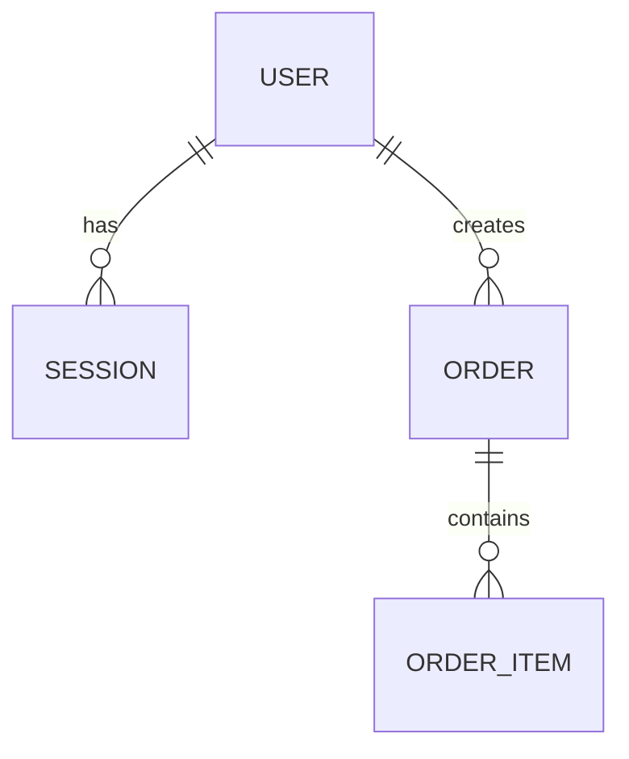

# System Design Instruction — Step 2

Create system architecture, database design, and API contract documents based on the approved PRD and Step 1 planning outputs. These documents become the technical Single Source of Truth for project setup, task generation, development execution, testing, and deployment preparation.

---

## Required Work Before Generation

Read all of the following before creating system design documents:

1. `PRD.md`
   - Section 2 Module Definitions
   - Section 6 Data Model
   - Section 7 State Transition Rules
   - Section 9 API Endpoint List
   - Section 13 Non-Functional Requirements
   - Section 15 Technology Stack
2. Step 1 planning outputs
   - `docs/plans/{module}/spec.md`
   - `docs/plans/wireframes/{module}.html`
   - `docs/plans/policies/{policy}.md`
   - `docs/plans/design-system.md`
   - `docs/plans/ui-implementation-rules.md`
3. Confirm or create:

```text
docs/architecture/
```

Do not begin generation until these files have been read.

---

## Required Output Paths

Create exactly these files:

```text
docs/architecture/
├── architecture.md
├── db-design.md
└── api-contract.md
```

Do not create alternative architecture paths unless the pipeline is updated.

---

# Output 1: `architecture.md`

## Required Sections

```markdown
# System Architecture

## 1. System Architecture Diagram
## 2. Architecture Decision Records
## 3. Runtime Architecture
## 4. Module Boundaries
## 5. Authentication and Authorization Architecture
## 6. Middleware Chain
## 7. Error Handling Strategy
## 8. Logging and Monitoring Strategy
## 9. Caching Strategy
## 10. External Service Integration Strategy
## 11. Environment and Deployment Architecture
## 12. Security Considerations
```

---

## 1. System Architecture Diagram

Represent the full system with an ASCII diagram. Include frontend, backend, database, external services, authentication path, and data-flow arrows.

Example:

```text
┌─────────────────────────────────────────────┐
│                   Client                    │
│  ┌─────────┐  ┌──────────┐  ┌────────────┐ │
│  │ Next.js │  │ Zustand  │  │React Query │ │
│  └────┬────┘  └────┬─────┘  └─────┬──────┘ │
└───────┼────────────┼───────────────┼────────┘
        │ HTTPS      │               │
        ▼            ▼               ▼
┌─────────────────────────────────────────────┐
│                 API Server                  │
│  Router → Middleware → Service → Repository │
│  Auth → Validation → Rate Limit → Error     │
└────────────────────┬────────────────────────┘
                     ▼
┌─────────────────────────────────────────────┐
│                  Database                   │
│             Tables / Indexes / FK           │
└─────────────────────────────────────────────┘
```

### Diagram Rules

- Include every external service from PRD Section 10.
- Show authentication flow separately.
- Show main read/write data flow.
- Show background jobs or queues if the PRD requires them.

---

## 2. Architecture Decision Records

Use ADR format for every major technical decision.

```markdown
### ADR-{number}: {Decision Title}

- **Status**: Approved
- **Context**: why this decision is needed
- **Decision**: what is selected
- **Rationale**: why it is selected, including alternatives
- **Consequences**: tradeoffs and expected impact
```

### Required ADRs

| ADR | Topic | Decision Basis |
|---|---|---|
| ADR-01 | Frontend framework | PRD Section 15 + project preference |
| ADR-02 | Backend framework | Next.js API routes vs separate backend server |
| ADR-03 | ORM | Prisma vs Drizzle based on data complexity |
| ADR-04 | Database | PRD Section 6 data characteristics |
| ADR-05 | Authentication | JWT vs session vs OAuth based on security requirements |
| ADR-06 | State management | Zustand / React Query / other based on complexity |
| ADR-07 | API communication | REST vs GraphQL, caching approach |
| ADR-08 | Deployment environment | PRD Sections 13 and 15 |
| ADR-09 | Testing strategy | integration + E2E + security gates |
| ADR-10 | Project isolation | separate Git, DB, env, deployment settings per project |

If the PRD specifies a technology, follow it and document the rationale. If the PRD is ambiguous, choose a practical default and explain alternatives.

---

# Output 2: `db-design.md`

## Required Sections

```markdown
# Database Design

## 1. Overview
## 2. ERD
## 3. Table Definitions
## 4. Enum Definitions
## 5. Index Design
## 6. Relationship and FK Rules
## 7. Query Patterns
## 8. Transaction Rules
## 9. Migration Strategy
## 10. Seed Data Strategy
## 11. Data Retention and Backup
## 12. Validation Against PRD
```

---

## 1. ERD

Use Mermaid or a clear table/ASCII format.



### ERD Rules

- Every PRD entity must appear.
- Every foreign key relationship must be shown.
- Cardinality must be clear.
- Many-to-many relationships must use join tables.

---

## 2. Table Definitions

```markdown
### users

| Column | Type | Null | Default | Constraint | Description |
|---|---|---|---|---|---|
| id | uuid | no | gen_random_uuid() | PK | user ID |
| email | varchar(255) | no | - | UNIQUE | login email |
| created_at | timestamp | no | now() | - | creation time |
```

### Rules

- Every PRD field must map to a DB column or be explicitly marked as computed/non-persistent.
- Every enum field must reference a defined enum.
- Every unique rule in PRD/policy must have a DB or application-level constraint.
- Every status field must support the state transitions from PRD Section 7.

---

## 3. Index Design

```markdown
| Table | Index Name | Columns | Type | Reason |
|---|---|---|---|---|
| users | users_email_idx | email | unique | login lookup |
| orders | orders_user_status_idx | user_id, status | btree | user order list filter |
```

### Rules

- Add indexes for common lookup patterns.
- Add compound indexes for list screens and filters.
- Avoid unnecessary indexes that slow writes.
- Include performance rationale.

---

## 4. Query Patterns

```markdown
### Q-{MODULE}-{number}: {query name}
- Used by: {API endpoint or feature}
- Pattern: SELECT / INSERT / UPDATE / DELETE
- Filter: {fields}
- Sort: {fields}
- Expected index: {index name}
```

Every list/detail API should have at least one query pattern.

---

## 5. Transaction Rules

Define transactions for operations that update multiple tables or require state consistency.

```markdown
| Operation | Tables | Transaction Required | Reason |
|---|---|---|---|
| Create order | orders, order_items, payments | yes | prevent partial order creation |
```

---

## 6. Migration Strategy

```markdown
| Migration | Change | Risk | Rollback Method |
|---|---|---|---|
| 001_init | create base tables | low | drop tables in reverse order |
```

Include notes for destructive changes, large tables, enum changes, and rollback constraints.

---

# Output 3: `api-contract.md`

## Required Sections

```markdown
# API Contract

## 1. API Overview
## 2. Common Request Rules
## 3. Common Response Format
## 4. Authentication Header
## 5. Error Response Format
## 6. Pagination Format
## 7. Endpoint Contracts by Module
## 8. Webhook/Event Contracts
## 9. Rate Limiting
## 10. API ↔ PRD Validation Matrix
```

---

## Common Response Format

```typescript
type SuccessResponse<T> = {
  success: true;
  data: T;
  meta?: PaginationMeta | Record<string, unknown>;
};

type ErrorResponse = {
  success: false;
  error: {
    code: string;
    message: string;
    details?: unknown;
  };
};
```

---

## Endpoint Contract Format

```markdown
### POST /api/auth/login

- **Endpoint ID**: API-AUTH-01
- **Feature IDs**: F-AUTH-01
- **Auth**: public
- **Roles**: GUEST

#### Request Body
```json
{
  "email": "user@example.com",
  "password": "string"
}
```

#### Success Response: 200
```json
{
  "success": true,
  "data": {
    "accessToken": "string",
    "refreshToken": "string",
    "user": {}
  }
}
```

#### Error Responses
| HTTP | Error Code | Condition |
|---|---|---|
| 400 | E-AUTH-INVALID-INPUT | invalid request body |
| 401 | E-AUTH-INVALID-CREDENTIALS | wrong email or password |
```

### Rules

- Every endpoint in PRD Section 9 must appear in `api-contract.md`.
- Do not add endpoints unless the PRD or spec requires them.
- Every request field must specify type, required/optional status, validation rule, and example.
- Every response must define the exact JSON shape.
- Every error must map to PRD Section 11.
- Auth and role requirements must match the PRD permission matrix.

---

## Cross-Validation Checklist

### PRD ↔ DB Design

- Every PRD entity appears in `db-design.md`.
- Every PRD enum appears in DB enum definitions or application-level enum definitions.
- Every stateful entity supports PRD state transitions.
- Every uniqueness/business rule has a DB or application-level constraint.

### PRD ↔ API Contract

- Every API endpoint from PRD Section 9 appears in `api-contract.md`.
- Every endpoint maps to at least one feature ID.
- Every API error maps to PRD Section 11.
- Auth and role requirements match PRD Section 3.

### DB Design ↔ API Contract

- API request/response fields are compatible with DB fields.
- Create/update endpoints include required DB fields or defaults.
- List endpoints include filters supported by indexes.
- Transactional endpoints match transaction rules.

### Architecture Internal Consistency

- ADR decisions align with file structure and deployment assumptions.
- Middleware chain supports auth, validation, rate limiting, and error handling.
- External service failures have fallback or retry strategy.
- Project isolation is reflected in Git, DB, env, and deployment design.

---

## Completion Report

After generation, report:

```markdown
## System Design Ready for Review

### Generated Files
- docs/architecture/architecture.md
- docs/architecture/db-design.md
- docs/architecture/api-contract.md

### Validation Result
- PRD ↔ DB Design: passed / failed
- PRD ↔ API Contract: passed / failed
- DB Design ↔ API Contract: passed / failed
- Architecture Internal Consistency: passed / failed

### Review Points
- architecture decisions
- DB schema and indexes
- API request/response contracts
- authentication and authorization
- deployment environment assumptions
```
